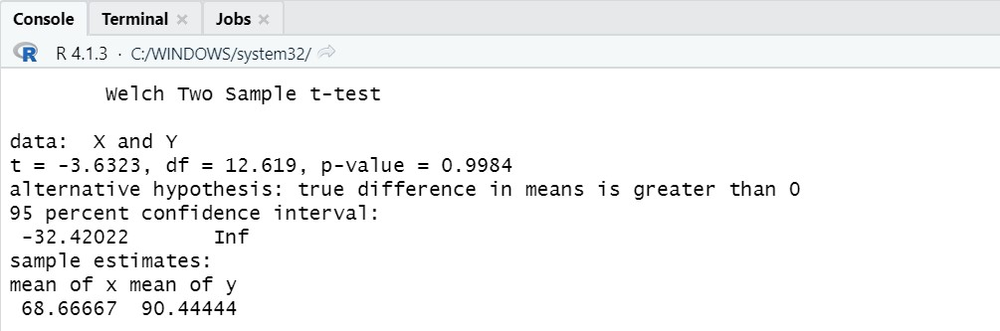

# P2_Probstat_D_5025201263

## Soal 1
### No 1a. 


Standar deviasi didapatkan dari selisih X dan Y

```
  data <- data.frame(R,X,Y)
  selisih = Y-X
  standardeviasi <- sd(selisih)
  standardeviasi
```

### No 1b. 

Hasil dari t.test
```
t.test(X, Y, alternative = "greater", var.equal = FALSE)
```

### No 1c. 


convidence dan mean sama memiliki nilai yang sama dengan 1b. 
Sehingga tidak memiliki pengaruh yang signifikan secara statistika

## Soal 2
### No 2a.

Dengan kata lain, kita dapat setuju dengan klaim tersebut karena nilai yang didapatkan sesuai dengan klaim yang dinyatakan (lebih dari 20.000)
