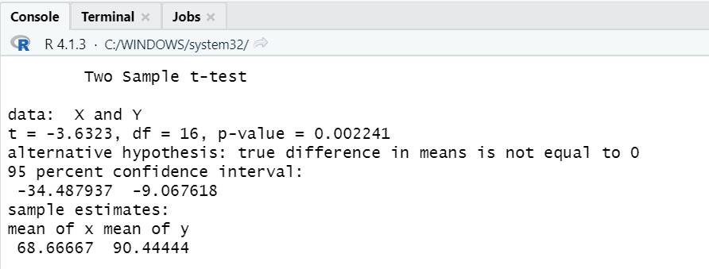

# P2_Probstat_D_5025201263

## Soal 1
### No 1a.


Standar deviasi didapatkan dari selisih X dan Y

```
  data <- data.frame(R,X,Y)
  selisih = Y-X
  standardeviasi <- sd(selisih)
  standardeviasi
```

### No 1b. 

Hasil dari t.test
```
t.test(X, Y, alternative = "greater", var.equal = FALSE)
```

### No 1c. 


Convidence dan mean memiliki nilai yang sama dengan 1b. 
Sehingga tidak memiliki pengaruh yang signifikan secara statistika

## Soal 2
### No 2a.


Nilai yang didapatkan sesuai sehingga kita dapat setuju dengan klaim tersebut

### No 2b.
Outputnya yaitu: H0: μ = 20000, H1: μ > 20000, dan nilai z: 8,9744

### No 2c. 
Kesimpulan
Didapat nilai P mendekati 0, jadi tidak setuju untuk H0 dan mobil dikemudikan lebih dari 20.000 per tahun

## Soal 3
### No 3a.

### No 3b.
### No 3c. 
