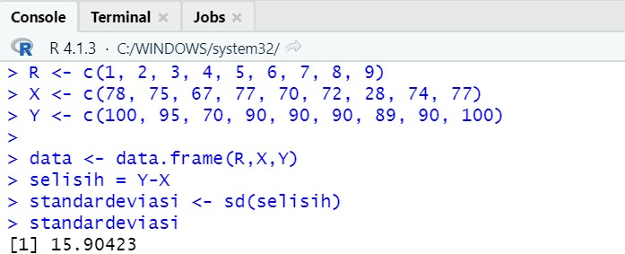

# P2_Probstat_D_5025201263

## Soal 1
### No 1a.


Standar deviasi didapatkan dari selisih X dan Y

```
  data <- data.frame(R,X,Y)
  selisih = Y-X
  standardeviasi <- sd(selisih)
  standardeviasi
```

### No 1b. 

Hasil dari t.test
```
t.test(X, Y, alternative = "greater", var.equal = FALSE)
```

### No 1c. 


Convidence dan mean memiliki nilai yang sama dengan 1b. 
Sehingga tidak memiliki pengaruh yang signifikan secara statistika

## Soal 2
### No 2a.


Nilai yang didapatkan sesuai sehingga kita dapat setuju dengan klaim tersebut

### No 2b.
Outputnya yaitu: H0: μ = 20000, H1: μ > 20000, dan nilai z: 8,9744

### No 2c. 
Kesimpulan
Didapat nilai P mendekati 0, jadi tidak setuju untuk H0 dan mobil dikemudikan lebih dari 20.000 per tahun

## Soal 3
### No 3a.


### No 3b.

Hasil di dapat menggunakan ```tsum.test```
```
tsum.test(mean.x = 3.64, s.x = 1.67, n.x = 19, mean.y = 2.97, s.y = 1.32, n.y = 27, alternative = "greater", var.equal = TRUE)
```
### No 3c. 

Dengan rumus sebagai berikut
```
sp2 = ((27 - 1)*(1.32)^2) + ((19 - 1)*(1.67)^2)/(27 + 19 - 2)
sp <- sqrt(sp2)
x2 <- (1/27) + (1/19)
x <- sqrt(x2)
t <- (2.79 - 3.64)/(sp*x)
```
### No 3d.

Nilai kritikal
```
qt(p = 0.025, df = 2, lower.tail = FALSE)
```
### No 3e. 

FALSE karena hasilnya stat lebih besar daripada kritikal

### No 3f.
Kesimpulan
Dilihat dari hasil, rata-rata saham Bali dan saham Bandung sama
